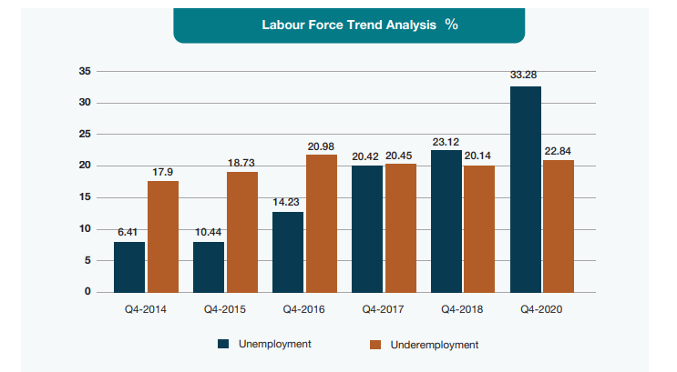
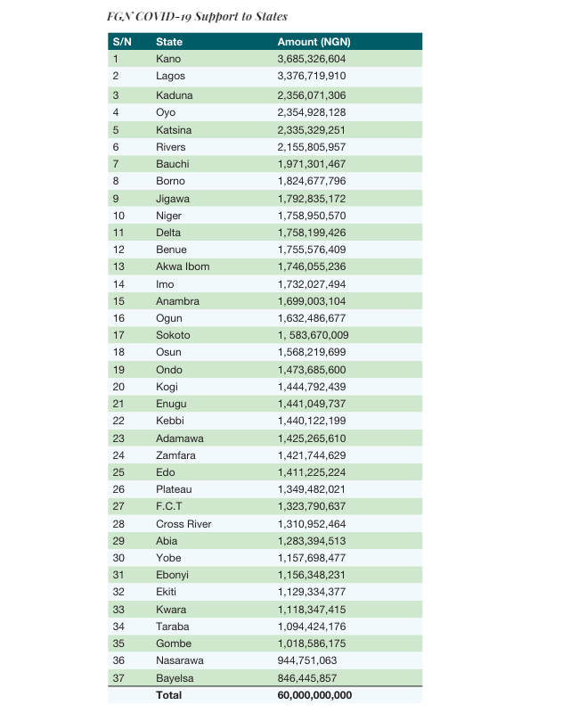
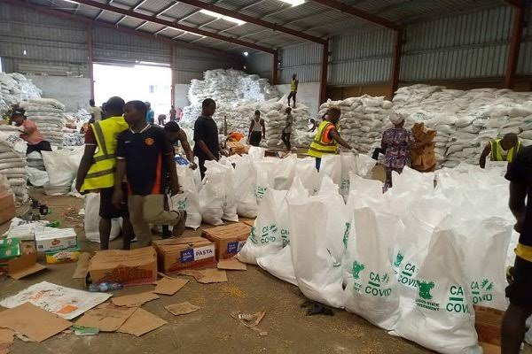
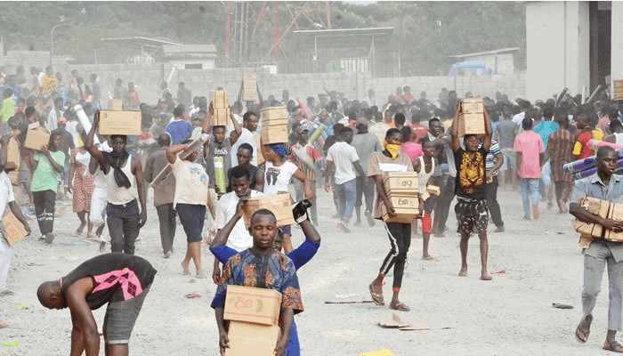

## Nigeria's COVID-19 Response: Data Analysis and Accountability

# Objective
The objective of this project is to analyze the response and interventions of the Nigerian government and various organizations during the COVID-19 pandemic, focusing on the distribution and effectiveness of palliatives, the implementation of economic sustainability plans, and the overall impact on the socio-economic landscape of the country.

# Data Sources
Government Reports: Data from official government publications, including announcements from the Presidential Task Force (PTF) on COVID-19, Federal Ministry of Health, and Nigerian Centre for Disease Control (NCDC) reports.

Surveys and Statistics: Household data obtained from the National Bureau of Statistics (NBS) and other relevant national surveys.

NGO and Private Sector Reports: Information from non-governmental organizations, private sector coalitions like the Coalition Against COVID-19 (CACOVID), and other relevant stakeholders.

Media Reports: Data gathered from news articles, field reports, and investigations by journalists.

Community Feedback: Information collected from community development associations, local leaders, and beneficiaries of palliative distributions.

# Data Types
Quantitative Data: Numbers of COVID-19 cases, recoveries, and deaths; financial allocations; quantities of distributed palliatives; numbers of beneficiaries.

Qualitative Data: Descriptions of distribution processes, community feedback, and challenges faced during the implementation of interventions.

# Method of Analysis
Descriptive Analysis: Summarizing the collected data to provide an overview of the COVID-19 response, including the number of cases, distribution of palliatives, and economic support measures.

Comparative Analysis: Comparing the distribution and effectiveness of palliatives across different states and communities to identify patterns, discrepancies, and areas needing improvement.

Thematic Analysis: Analyzing qualitative data from community feedback and media reports to identify common themes and issues regarding the transparency, fairness, and efficiency of the response measures.

Impact Assessment: Evaluating the socio-economic impact of the pandemic and the subsequent interventions on vulnerable populations, including the effectiveness of economic sustainability plans.

# Tools and Techniques
Data Visualization: Using charts, graphs, and maps to visually represent the distribution of COVID-19 cases, palliatives, and economic support measures.
Statistical Software: Employing software like SPSS, R, or Python for quantitative data analysis.
Content Analysis: Systematically coding and interpreting qualitative data from reports and community feedback.

# Introduction
In 2020, countries worldwide faced the SARS-Cov-2 pandemic, commonly known as COVID-19. Originating in Wuhan, China, in November 2019, the virus rapidly spread to various nations, including Nigeria. Nigeria's battle with COVID-19 began on February 27, 2020, when the first case was reported in Lagos, which became the epicenter of the virus in the country. As of April 8, 2021, Nigeria had 163,498 confirmed cases, 153,750 recoveries, and 2058 deaths.

To curb the virus's spread, the Nigerian government adopted a multi-sectoral approach. The Federal Ministry of Health collaborated with the Nigerian Centre for Disease Control (NCDC) and other partners to manage the pandemic. Leveraging lessons from the Ebola outbreak, the NCDC established a multi-sectoral Coronavirus Preparedness Group within its national Emergency Operations Centre. This group, along with Lagos State Health authorities and the Port Health Services of the Federal Ministry of Health, swiftly implemented containment measures.

In March 2020, the Federal Government established a Presidential Task Force (PTF) on COVID-19, headed by Boss Mustapha. The PTF coordinated Nigeria's multi-sectoral inter-governmental efforts to contain the virus. One of the PTF's first actions was to impose travel restrictions on travelers from 13 high-risk countries. Despite these measures, enforcement was initially lax, leading to numerous entrants from other countries, many of whom did not comply with the recommended 14-day self-isolation.

The NCDC was primarily responsible for containing the virus. The federal government initiated palliative measures, distributing funds and food to those most affected. Despite this, many citizens violated the lockdown orders to make sales or earn money, leading to numerous arrests by the police. Unfortunately, enforcing the lockdown resulted in human rights breaches and needless deaths, with Lagos experiencing a spike in armed robberies and other adverse effects.

While these negative outcomes raise questions about the lockdown's effectiveness, there were positive aspects. The private sector, churches, and non-governmental organizations provided significant support, distributing food to deprived areas in Lagos and across Nigeria. There was hope that the health sector would finally receive the necessary attention from the government, learning from the pandemic. Despite socio-economic differences, there was a sense of togetherness in Nigerian communities during this challenging time.

# FGN Economic Sustainability & Recovery Plan
The federal government, recognizing the pandemic's damaging effects on the economy, livelihoods, and prospects, launched the Nigerian Economic Sustainability Plan (ESP). This plan aimed to protect the precarious incomes of Nigerians, businesses, and states, prevent massive unemployment, diversify revenue generation from oil to non-oil sources, and mitigate the economic downturn caused by reduced demand for commodities, especially crude oil. The ESP is essentially a stimulus package designed to counteract the effects of low economic activity.

The plan is structured around three pillars:

Real Sector: This includes agriculture and agro-processing, food security, housing construction, renewable energy, infrastructure, manufacturing, and the digital economy.

Fiscal and Monetary Measures: These are carefully measured fiscal and policy regulations and interventions designed to keep the economy functional.

Implementation: This involves clear lines of authority, proper supervision, and coordination between ministries, levels of government, and the private and public sectors.

The plan involved the phased disbursement of N2.3 trillion naira in critical sectors and among critical demographics. The government intended for the ESP to serve as a bridge between its previous Economic Recovery and Growth Plan (ERGP) and the successor plan to the ERGP. Below are some of the focus areas of the ESP:

Mass Agricultural Programme (MAP)
Infrastructure projects
Informal Sector Support
Business Support for MSMEs
Technology advancements
Expansion of National Social Investment Programmes
Cutting non-essential spending
Supporting state governments

## CACOVID (Coalition Against COVID-19)
According to Proshare, donations to CACOVID reached N21.5 billion as of April 7, 2020. This coalition was established in response to the COVID-19 pandemic. Donations included materials distributed to state governments and less privileged communities across Nigeria. However, many Nigerians complained about the lack of access to these palliatives. Questions arose about the storage of CACOVID palliatives, which were answered in October 2020 when several warehouses were discovered across the country, shortly after the #EndSARS protests. CACOVID had been unable to explain why these palliatives remained locked up six months post-lockdown. While the government and private sector made significant efforts to combat the COVID-19 crisis, issues of transparency and accountability persisted. There is hope that platforms like NOCOPO and Open Treasury will improve the situation, but many Nigerians continue to question the COVID-19 response.

# Palliative Allocation, Donations, Warehousing, and Distribution
As COVID-19 cases increased, the Federal Government announced a lockdown to reduce the spread of the virus. Subsequently, it provided palliatives, including conditional cash transfers, the homegrown school feeding programme, and the distribution of food items to affected states through the Ministry of Humanitarian Affairs. Critical agencies, such as the National Social Register of Poor and Vulnerable Households, the National Home-Grown School Feeding Programme, and the Household Uplifting Programme, were involved in the selection and distribution of these palliatives, working closely with the Minister of Humanitarian Affairs, Hajiya Sadiya Umar Farouq.

For the conditional cash transfer, in March 2020, the federal government announced the disbursement of N20,000 to 2.6 million vulnerable people under its N5,000 monthly stipend programme, later increasing to 3.6 million beneficiaries. Additionally, the Home-grown School Feeding Programme began in Abuja, Lagos, and Ogun, with plans to expand to all 36 states and the FCT. Beneficiaries received take-home rations valued at N4,200, which included a 5 kg bag of rice, a 5 kg bag of beans, 500 ml of vegetable oil, 750 ml of palm oil, 500 mg of salt, 15 eggs, and 140 gm of tomato paste.

The Coalition Against COVID-19 (CACOVID) also played a crucial role, assisting over 1.7 million households with palliatives, significantly easing the burden of the pandemic on Nigerian homes. In Kano State, for instance, CACOVID provided 224,110 cartons of rice and 112,055 bags of sugar, rice, pasta, salt, and garri for 112,005 households. Despite these efforts, some distributions were hijacked.

In Kano State, palliative distribution occurred in phases. The first phase started in March 2020 and covered the 4484 wards in the state. Despite the presence of district, ward, and village heads during distributions, many residents reported not receiving any palliatives. The items distributed included grains, rice, and vegetable oil, donated by the federal government and philanthropists like Dangote, BUA, civil society, and other foundations.

In Lagos, the federal government provided 6,000 bags of rice and two truckloads of vegetable oil for distribution to the poor and vulnerable. The state government also supported an economic stimulus package aimed at reaching at least 200,000 households. However, local government officials diverted part of these supplies. The Coalition Against COVID-19 (CACOVID) also assisted over 1.7 million households with palliatives. Unfortunately, some of these items were hijacked, and distribution processes were often criticized for lack of transparency.

In Ogun State, during our visit to Ijebu-Ode, we observed that palliatives were distributed to different groups, including notable elderly individuals identified by their Community Development Associations. In Owode, Abeokuta, and Sango, artisans received palliatives in clusters. Distribution often favored members of the ruling party, leaving many residents dissatisfied with the scanty provisions. Items such as pasta, rice, bread, beans, garri, and sachet groundnut oil were distributed in meager amounts, except for top politicians who received larger shares. In Idiaba, residents expressed disappointment with the handling of the palliatives. In Ijebu Ode, a warehouse storing palliatives was invaded by hoodlums who took away bags of cereals and cartons of noodles.

In Niger State, household data was obtained from the National Bureau of Statistics for palliative distribution. Committees were created at the local government and ward levels to supervise and ensure equitable distribution. Traditional rulers and security aids were included in the ward-level committees. Distribution, which covered all 25 local governments, was delayed due to a late supply of rice. Instructions were given not to distribute items until all supplies had arrived. Distributed items included 10 kg of rice, noodles, and pasta.

## Field Observations

Lagos State received 6,000 bags of rice and two truckloads of vegetable oil from the federal government for distribution to the poor and vulnerable. Additionally, the state government initiated an economic stimulus package targeting at least 200,000 households. However, some of these supplies were diverted by local government officials responsible for the distribution. However, In many areas, including Agege, Mushin, Ikorodu, Surulere, and Epe, palliatives were hijacked by politicians and distributed among party members, excluding non-party residents. During the #EndSARS protests, hoodlums looted a government warehouse in Maza-Maza, Ojo LGA, Lagos State, where COVID-19 relief food items were stored.

Residents of Kano State reported that the palliative selection process favored political party loyalists, excluding vulnerable community members. Party leaders distributed items only to party members upon presentation of party cards or proof of affiliation with the ruling party.

In Rivers State, particularly in the Rumualogu community in Obio Akpor LGA, People with Disabilities and other vulnerable groups faced similar challenges, with many unable to access the distributed palliatives.

Palliatives were distributed to different groups in ijebu-ode, Ogun state, including notable elderly individuals identified by their Community Development Associations. In Owode, Abeokuta, and Sango, artisans received palliatives in clusters. Distribution often favored members of the ruling party, leaving many residents dissatisfied with the scanty provisions. Items such as pasta, rice, bread, beans, garri, and sachet groundnut oil were distributed in meager amounts, except for top politicians who received larger shares. In Idiaba, residents expressed disappointment with the handling of the palliatives. In Ijebu Ode, a warehouse storing palliatives was invaded by hoodlums who took away bags of cereals and cartons of noodles.

In Niger State, household data was obtained from the National Bureau of Statistics for palliative distribution. Committees were created at the local government and ward levels to supervise and ensure equitable distribution. Traditional rulers and security aids were included in the ward-level committees. Distribution, which covered all 25 local governments, was delayed due to a late supply of rice. Instructions were given not to distribute items until all supplies had arrived.

## Recommendations
A nation must never be caught unprepared by a pandemic. Health emergencies are inevitable, so it's crucial to be adequately prepared. To establish an effective framework for COVID-19 accountability in Nigeria, the government should prioritize the following:

Citizen Inclusion: Involve trusted individuals such as traditional rulers, religious leaders, and ward committees in the committees and task forces. Their inclusion can enhance trust and cooperation among the public.

Access to Information: Providing citizens with information is critical to enabling them to exercise their right to demand accountability and engage in dialogue with the government about decisions affecting them. The government must ensure transparency by informing citizens about the funds received for COVID-19 donations and publicly publishing the list of beneficiaries.

Establishment of Toll-Free Lines: Implement toll-free lines for citizens to report any cases of corruption related to palliative distribution. This measure will enhance transparency and accountability, reducing corruption in society.

Digital & Comprehensive Social Register: In August 2020, the Federal Ministry of Humanitarian Affairs, Disaster Management, and Social Development enrolled 15 million persons in a social register to expedite the implementation of social investment programs. However, there is a lack of proper verification methods for the names on the register, leading to politicization and fraud in cash transfers and social programs. The government should develop a single identity system to recognize Nigerian citizens easily and update the social register regularly to reflect the current realities of the people.

Misinformation Control: Misinformation can be more devastating than the health crisis itself. During the Ebola crisis in 2014, false reports about salt baths curing the virus led to fatalities and hospitalizations. In 2020, various untrue reports about COVID-19 circulated on platforms like WhatsApp. The government should block loopholes for speculation by providing necessary and credible information, helping to save more lives
